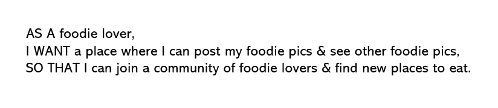

# Welcome to our MY PLATE app!

## Description

#### This MY PLATE app allows foodie lovers to sign in and create an account to be able to share their favorite plates of food. They can see other people's food posts and be able to get ideas of new food and restaurants to try. There are options to comment on posts, edit, and delete posts.

## Table of Contents
* [Installation](#installation)
* [Usage](#usage)
* [License](#license)
* [Demo](#demo)
* [Contributors](#contributors)

## Installation
In order to install this repository, you will need to clone it and run npm init to install all of the dependencies listed inside the package.json file.

## Usage
To use this app after cloning and initializing the dependencies, run server.js in the terminal to start it.

You will then see the confirmation that the port is listening.

When you open the port in the browser, the homepage will open with the option to login on the right side of the navigation bar.

When you click on the login option, you will be directed to the login page where you will create an account with your name, email address, and password.

Once you create an account, you can then login with your information next session.

Once you have created an account, you will have the ability to create a post with your favorite plate, title, and review of the food.

While you are signed in, you will also have access to comment on your post or other posts.

When you are logged in, you will be able to edit or delete your posts as well.

For your viewing pleasure, you can scroll through all the plates and reviews even if you are not logged in.

## License
The license for this project is the MIT.

Copyright © 2021

## Demo
Watch this demo to see the Employee Tracker in action!

### We hope you enjoy using this My Plate app! We welcome all contributions and feedback!

## Contributors
*If you have any questions, please reach out to us at*

### _Paul Frueh_ 

Paul's Github: [@pfrueh1](https://github.com/pfrueh1/)

### _Jared Gavigan_ 

Jared's Github: [@jargav](https://github.com/Jargav)

### _Jamie Williams_ 

Jamie's GitHub: [@jamwil1226](https://github.com/jamwil1226/)

